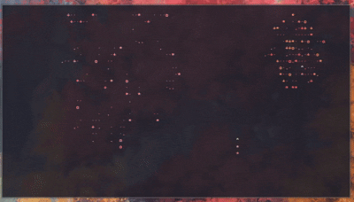

# terminal-cosmos



> *Sometimes you just want to watch the universe unfold in your terminal.* 🌌✨

A high-performance Python TUI application that transforms your terminal into a living cosmos with dynamic particle animations. Built with pure Python curses for smooth, flicker-free animations at 60 FPS.

## Features

### Performance Optimized
- **Zero External Dependencies** - Pure Python standard library implementation
- **60 FPS Animations** - Buttery smooth rendering with double-buffered updates
- **Pre-computation Caching** - Color attributes and gradients computed once, not per-frame
- **Optimized Data Structures** - Deque-based trail management for O(1) operations
- **Object Pooling** - Reusable particle objects eliminate allocation overhead

### Animation Modes
- **Meteor** - Fiery diagonal meteor showers with glowing trails (60-70% optimized)
- **Rain** - Gentle diagonal rain drops with smooth character animations
- **Lightning** - Rain with spectacular lightning bolt strikes
- **Space** - Horizontal scrolling starfield with cosmic events (meteors, satellites, planets)
- **Matrix** - Digital rain cascading down with character randomization
- **Warp** - 3D warp tunnel with perspective particles moving towards viewer
- **Fireworks** - Launching rockets with explosive bursts and crackling whistler effects

### Color System
- **Nine Schemes Per Mode** - red, blue, green, yellow, purple, cyan, gray, pink, orange
- **Mode-Specific Palettes** - Each mode defines colors matching its visual theme
- **Runtime Color Cycling** - Press 'C' to cycle through schemes without restart
- **Smooth Transitions** - Cache clearing ensures instant color changes with zero ghosting

### Performance Features
- **Mathematical Lookup Tables** - 6,000+ math.sin() calls/sec eliminated in Warp mode
- **Star Pre-grouping** - 30-40% faster rendering in Space mode
- **Trail Pre-computation** - 7,200 color calculations/sec eliminated in Meteor mode
- **Shared Particle Systems** - Reusable RainDrop class reduces code duplication

## Installation

### Prerequisites
- Python 3.8 or higher
- Terminal with curses and color support
- TTY environment (not compatible with dumb terminals)

### Install with pipx (Recommended)
```bash
# Install pipx if you don't have it
python3 -m pip install --user pipx
python3 -m pipx ensurepath

# Install terminal-cosmos
pipx install git+https://github.com/kestalkayden/terminal-cosmos.git
```

### Alternative Installation
```bash
# Clone and install locally
git clone https://github.com/kestalkayden/terminal-cosmos.git
cd terminal-cosmos
pip install -e .
```

## Usage

### Basic Usage
```bash
# Run with default settings (meteor mode, orange colors)
terminal-cosmos

# Specific mode with custom colors
terminal-cosmos --mode space --color blue

# Intense mode with more particles
terminal-cosmos --mode meteor --intense

# Matrix mode with classic green
terminal-cosmos --mode matrix --color green
```

### Command Line Options
```bash
terminal-cosmos --help                     # Show help
terminal-cosmos --mode meteor              # Animation mode: meteor, rain, lightning, space, matrix, warp, fireworks
terminal-cosmos --color orange             # Color scheme: red, blue, green, yellow, purple, cyan, gray, pink, orange
terminal-cosmos --intense                  # Intense mode (more particles/faster spawning)
```

### Animation Modes
- `meteor` - Diagonal meteor shower with bright fiery trails (default)
- `rain` - Gentle diagonal rain with smooth animations
- `lightning` or `storm` - Rain with lightning bolt effects
- `space` - Horizontal scrolling stars with cosmic events
- `matrix` - Cascading digital rain with character randomization
- `warp` - 3D warp tunnel with perspective depth
- `fireworks` - Launching rockets with explosive particle bursts and white crackling whistlers

### Color Options
Each mode supports 9 color schemes:
- `red` - Fiery reds and oranges
- `blue` - Cool blues and purples
- `green` - Natural greens and teals
- `yellow` - Warm yellows and golds
- `purple` - Deep purples and magentas
- `cyan` - Electric cyans and aquas
- `gray` - Monochrome grays and silvers
- `pink` - Soft pinks and magentas
- `orange` - Bright oranges and ambers (default for Meteor)

### Performance Options
- `--intense` - Enable intense mode for more particles/faster spawning

### Runtime Controls (while application is running)
- **C/c** - Cycle through color schemes
- **M/m** - Switch animation modes
- **Q/ESC** - Quit application

## Examples

### Animation Mode Showcase
```bash
# Fiery meteor shower with orange gradients
terminal-cosmos --mode meteor --color orange

# Tranquil rain with cyan tones
terminal-cosmos --mode rain --color cyan

# Dramatic lightning storm with blue colors
terminal-cosmos --mode lightning --color blue --intense

# Cosmic starfield with purple nebula colors
terminal-cosmos --mode space --color purple

# Classic Matrix green digital rain
terminal-cosmos --mode matrix --color green

# Hyperspeed warp tunnel with red streaks
terminal-cosmos --mode warp --color red --intense
```

### Performance Demonstrations
```bash
# Maximum particle density for presentations
terminal-cosmos --mode meteor --intense

# Smooth space experience at default settings
terminal-cosmos --mode space --color blue

# Intense Matrix for dynamic displays
terminal-cosmos --mode matrix --color green --intense

# Intense warp speed effect
terminal-cosmos --mode warp --intense
```

### Creative Combinations
```bash
# Tranquil rain for focus sessions
terminal-cosmos --mode rain --color cyan

# Rapid meteor shower for exciting backgrounds
terminal-cosmos --mode meteor --intense --color orange

# Gentle space drift for ambient displays
terminal-cosmos --mode space --color blue

# Classic Matrix hacker aesthetic
terminal-cosmos --mode matrix --color green

# Psychedelic warp tunnel experience
terminal-cosmos --mode warp --color purple --intense

# Celebratory fireworks with rainbow colors (default)
terminal-cosmos --mode fireworks

# Red fireworks for festive occasions
terminal-cosmos --mode fireworks --color red
```

## Performance Highlights

Terminal Cosmos is built for performance with measurable optimizations:

- **Meteor Mode**: 60-70% faster trail rendering, eliminates 7,200 color calculations/sec
- **Matrix Mode**: Pre-computed color attributes eliminate 3,000 generations/sec
- **Warp Mode**: Sin lookup table eliminates 6,000 math.sin() calls/sec
- **Space Mode**: Star pre-grouping provides 30-40% rendering improvement
- **Fireworks Mode**: Pre-computed characters eliminate 38,400+ RNG calls/sec, CPU usage ~1.2-1.5%
- **All Modes**: Deque-based trail management provides O(1) operations (was O(n))

Zero visual regressions across all optimizations - what you see is what you get, just faster.

## Technical Details

### Architecture
- **Double-buffered Rendering** - Prevents screen flicker
- **Pre-computation Caching** - Colors and gradients computed once during initialization
- **Object Pooling** - Particle reuse eliminates allocation overhead
- **Shared Utilities** - Common particle systems and color helpers reduce duplication

### Frame Rates
- Meteor, Rain, Lightning, Space, Warp: 60 FPS
- Fireworks: 30 FPS (optimized for smooth bursts with low CPU usage)
- Matrix: 10 FPS (intentional for authentic effect)

### Code Quality
- Mode-specific color palettes for thematic consistency
- Extensible animation framework for easy mode additions
- Comprehensive inline documentation
- ~150 lines of duplicate code eliminated through refactoring

## Contributing

1. Fork the repository
2. Create a feature branch (`git checkout -b feature/amazing-feature`)
3. Commit your changes (`git commit -m 'Add amazing feature'`)
4. Push to the branch (`git push origin feature/amazing-feature`)
5. Open a Pull Request

## License

This project is licensed under the MIT License - see the [LICENSE](LICENSE) file for details.

## Acknowledgments

- Inspired by cmatrix, terminal-rain, and other classic terminal animations
- Python curses library for rock-solid terminal graphics
- The cosmos, for being endlessly inspiring